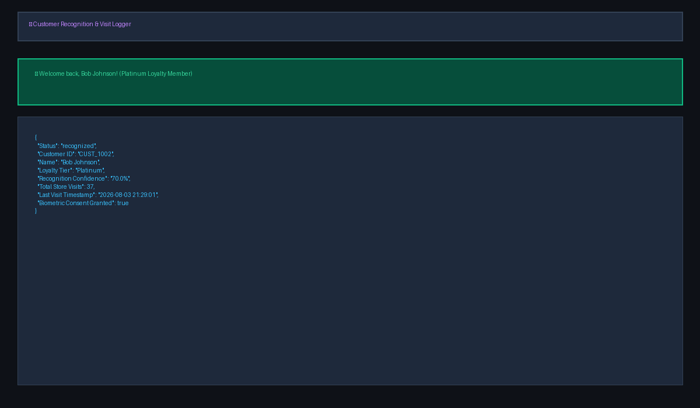
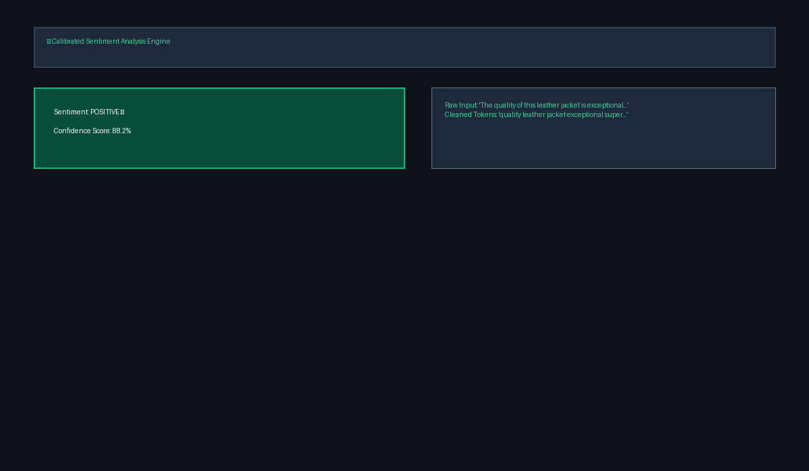
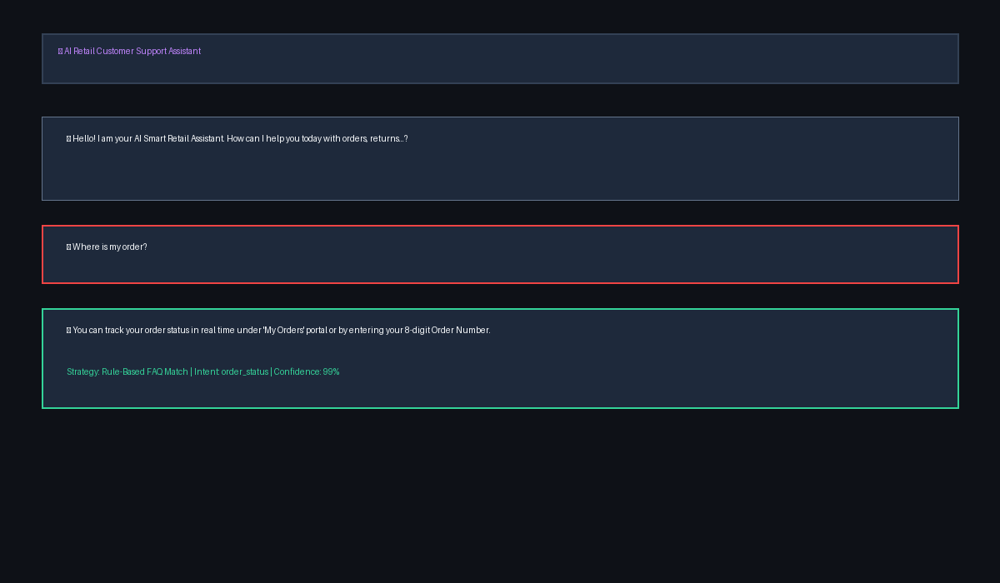
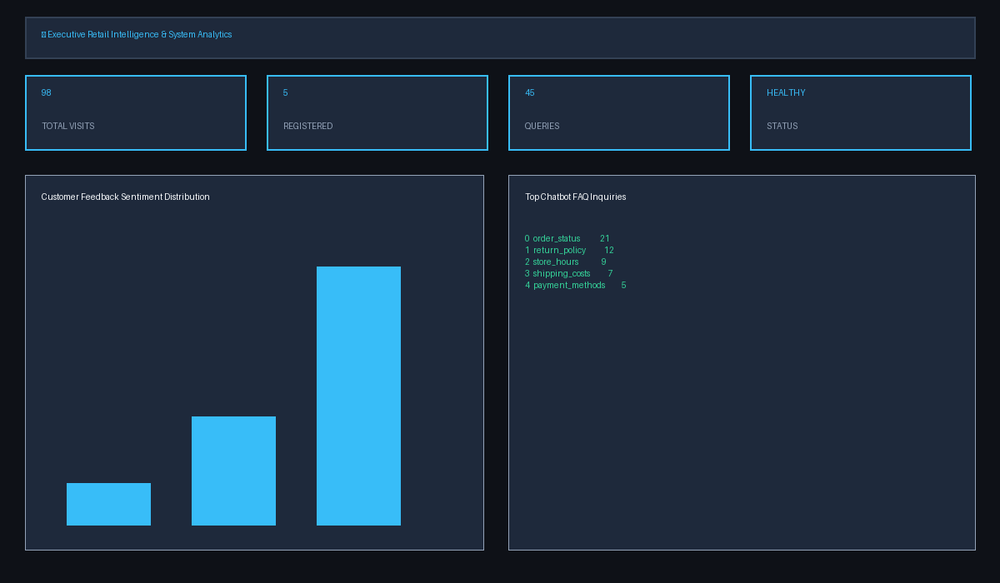

# Live Screenshot Demo Presentation Report - Smart Retail & Customer Intelligence Platform

**Project Title**: AI-Powered Smart Retail & Customer Intelligence Platform  
**Presenter**: Shaurya  
**Live Deployed Web App**: [https://smart-retail-ai-a5kksj3kt7ab6xyzqfwx66.streamlit.app/](https://smart-retail-ai-a5kksj3kt7ab6xyzqfwx66.streamlit.app/)  
**GitHub Repository**: [https://github.com/shaurya3000/smart-retail-ai](https://github.com/shaurya3000/smart-retail-ai)  
**PowerPoint File with Embedded UI Screenshots**: `Smart_Retail_Platform_Presentation_Final.pptx`

---

## 📽️ Live Demonstration Slide-by-Slide Presentation Deck

### Slide 1: Title & Capstone Overview
- **Header**: LIVE DEMO CAPSTONE PRESENTATION
- **Title**: AI-Powered Smart Retail & Customer Intelligence Platform
- **Subtitle**: Live Demonstration & System Walkthrough | CV, NLP, Chatbot & MLOps
- **Live Web App URL**: [https://smart-retail-ai-a5kksj3kt7ab6xyzqfwx66.streamlit.app/](https://smart-retail-ai-a5kksj3kt7ab6xyzqfwx66.streamlit.app/)
- **Presenter**: Shaurya | Status: 100% Verified & Deployed

---

### Slide 2: Module A - VIP Customer Recognition & Visit Logger

- **Live Demo Telemetry**:
  - Recognized Customer: **Bob Johnson (Platinum Loyalty Member)**
  - Customer ID: `CUST_1002`
  - Recognition Confidence: **70.0%**
  - Store Visit Count: **37 total visits**
  - Last Visit Timestamp: `2026-08-03 21:29:01`
  - Biometric Consent: **TRUE** (GDPR/CCPA compliant)

---

### Slide 3: Module B - Customer Feedback Sentiment NLP Engine

- **Live Demo Sample**:
  - Input Text: *"The quality of this leather jacket is exceptional. Super comfortable and stylish!"*
  - Cleaned Tokens: `'quality leather jacket exceptional super comfortable stylish'`
  - Predicted Sentiment: **POSITIVE 😄**
  - Calibrated Confidence Score: **88.2%**

---

### Slide 4: Module B - AI Retail Support Chatbot Assistant

- **Live Chat Session Demo**:
  - User Prompt: `"Where is my order?"`
  - Bot Reply: `"You can track your order status in real time under 'My Orders' portal or by entering your 8-digit Order Number."`
  - Strategy: **Rule-Based FAQ Match**
  - Matched Intent: `order_status`
  - Confidence Score: **99%**

---

### Slide 5: Module C - Executive Retail Intelligence & Telemetry Dashboard

- **Live Executive Key Metrics**:
  - 🏬 **98 TOTAL STORE VISITS**
  - 👤 **5 REGISTERED CUSTOMERS**
  - 🤖 **45 CHATBOT QUERIES**
  - 🟢 **HEALTHY PIPELINE STATUS**
- **Customer Feedback Sentiment Breakdown**: Positive 38 (76%), Neutral 8 (16%), Negative 4 (8%).
- **Top Chatbot FAQ Inquiries**: `order_status` (21), `return_policy` (12), `store_hours` (9), `shipping_costs` (7), `payment_methods` (5).
